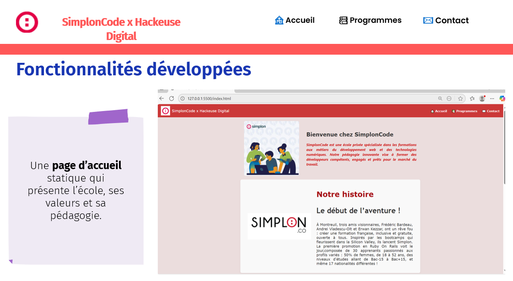
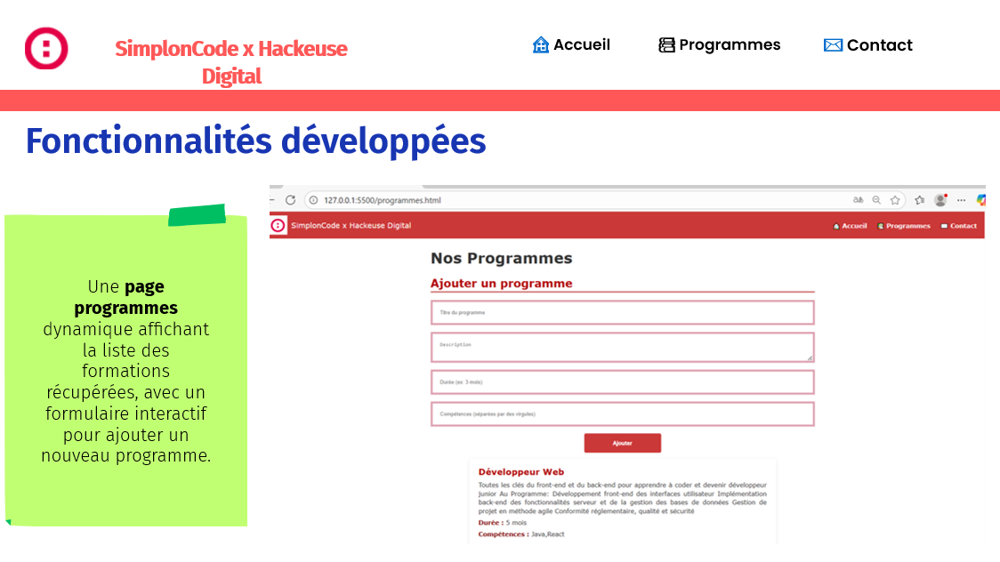
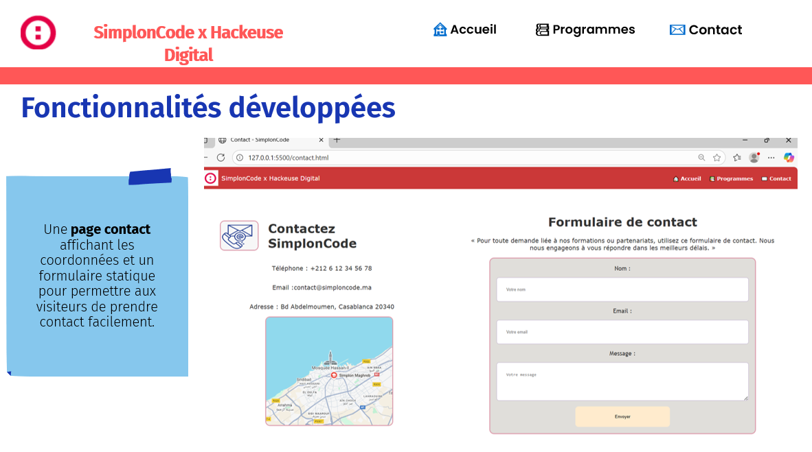

# 🌐 Projet : Site Vitrine SimplonCode x Hackeuse Digital

 Projet réalisé par 👩‍💻 Fatima-ezzahra Baalla 

## 🎯 Objectifs du site

Le site doit être simple, clair, et permettre de :

✔️ Présenter l’école, son histoire, ses valeurs et sa pédagogie  
✔️ Mettre en avant les programmes de formation (avec ajout dynamique)  
✔️ Faciliter la prise de contact grâce à une page dédiée  

---
## 🖼️ Aperçu du site 

### 
  Page d’accueil (Home)  

---

### 
  Page Programmes  

---
### 
  Page Contact 

---

